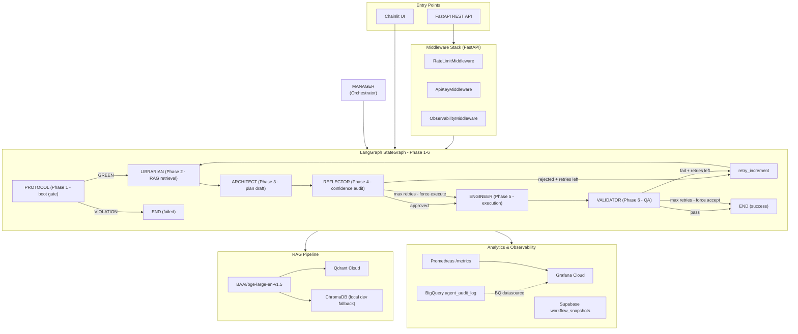
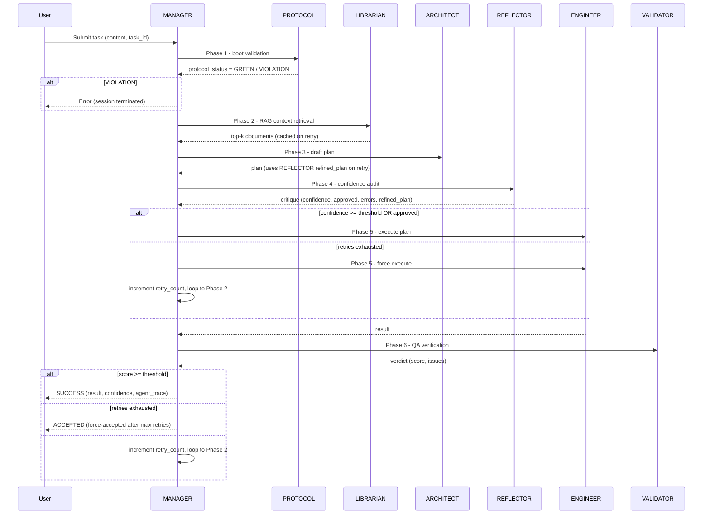
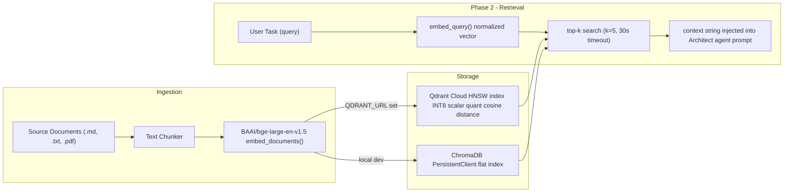
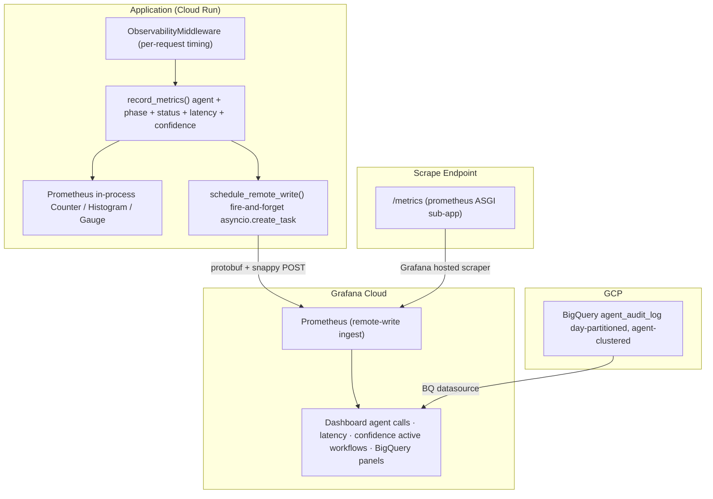

# Agentics SDLC

<!-- AI / LLM / Orchestration -->


<!-- Backend / Data / Storage -->


<!-- Infrastructure / DevX -->


---

## Table of Contents

- [Agentics SDLC](#agentics-sdlc)
  - [Table of Contents](#table-of-contents)
  - [Project Overview](#project-overview)
  - [Showcase](#showcase)
    - [Video Demo](#video-demo)
    - [Screenshots](#screenshots)
  - [Architecture Overview](#architecture-overview)
    - [Agentics SDLC Industrial Workflow](#agentics-sdlc-industrial-workflow)
    - [The Core Model](#the-core-model)
  - [Agent Roster](#agent-roster)
  - [Technology Stack](#technology-stack)
  - [Key Decisions](#key-decisions)
    - [LangGraph for Stateful Agent Orchestration](#langgraph-for-stateful-agent-orchestration)
    - [Protocol-as-Middleware](#protocol-as-middleware)
    - [Retry Loop with Confidence Gate](#retry-loop-with-confidence-gate)
  - [Key Features](#key-features)
    - [Protocol Compliance](#protocol-compliance)
    - [Skills Registry](#skills-registry)
    - [Live Step Streaming](#live-step-streaming)
    - [Reflector Persona Framework](#reflector-persona-framework)
    - [Confidence-Gated Retry Loop](#confidence-gated-retry-loop)
    - [RAG Pipeline](#rag-pipeline)
    - [End-to-End Observability](#end-to-end-observability)
  - [RAG Pipeline Detail](#rag-pipeline-detail)
  - [Observability Architecture](#observability-architecture)
  - [Directory Structure](#directory-structure)
  - [Setup \& Installation](#setup--installation)
    - [Prerequisites](#prerequisites)
    - [Local Development](#local-development)
    - [Minimum .env Configuration](#minimum-env-configuration)
  - [Running the Application](#running-the-application)
    - [FastAPI Backend](#fastapi-backend)
    - [Chainlit UI](#chainlit-ui)
    - [Running Tests](#running-tests)
  - [Infrastructure Deployment (Terraform)](#infrastructure-deployment-terraform)
  - [License](#license)
  - [Contact and Support](#contact-and-support)

---

## Project Overview

**Agentics SDLC** is a production-grade, serverless **Multi-Agent System (MAS)** that orchestrates the Software Development Life Cycle end-to-end. You give it a high-level intent ("Build this feature") and it coordinates seven specialized AI agents through a protocol-enforced 6-phase pipeline to produce production-quality output.

Under the hood it runs on **LangGraph** where each node is a specialist agent. The **MANAGER** acts as the central router, dispatching work to lazy-loaded agents: **ARCHITECT** (planning), **REFLECTOR** (confidence-gated critique), **ENGINEER** (execution), **VALIDATOR** (QA), **LIBRARIAN** (RAG context retrieval), and **PROTOCOL** (boot-time law enforcement on every request).

Two independent interfaces sit on top: a **FastAPI** REST backend with SSE streaming, and a **Chainlit** real-time chat UI with live per-phase Steps. Both share the same LangGraph graph, analytics pipeline (BigQuery + Supabase), and Prometheus/Grafana Cloud observability stack. Everything is codified in **Terraform** and ships to **GCP Cloud Run** through a CI/CD service account.

---

## Showcase

### Video Demo

https://github.com/user-attachments/assets/7c05cd25-643e-4e97-ade8-7b146ab97f39

### Screenshots

<table>
  <tr>
    <td align="center" width="50%">
      <strong>1 - App UI: Welcome Screen</strong><br/>
      <em>Clean entry point with curated starter tasks. One click to launch the full SDLC pipeline</em><br/><br/>
      
    </td>
    <td align="center" width="50%">
      <strong>2 - App UI: Live Chat</strong><br/>
      <em>Real-time agent Steps, TaskList progress tracker, confidence badge, and agent trace side panel</em><br/><br/>
      
    </td>
  </tr>
  <tr>
    <td align="center" width="50%">
      <strong>3 - Workflow Result: Full Output</strong><br/>
      <em>Task ID, status, confidence score, phases executed, step-by-step implementation, and agent trace - all in one view</em><br/><br/>
      
    </td>
    <td align="center" width="50%">
      <strong>4 - Settings Panel: Tune the Agents</strong><br/>
      <em>Confidence threshold, score threshold, max retries, verbosity, and agent trace toggle - all user-configurable per session</em><br/><br/>
      
    </td>
  </tr>
  <tr>
    <td align="center" width="50%">
      <strong>5 - Dark / Light Mode</strong><br/>
      <em>Split view: dark mode (primary) on the left, light mode on the right</em><br/><br/>
      
    </td>
    <td align="center" width="50%">
      <strong>6 - Grafana Observability Dashboard</strong><br/>
      <em>Prometheus metrics: agent calls, latency histograms, confidence gauges</em><br/><br/>
      
    </td>
  </tr>
</table>

---

## Architecture Overview

**Agentics SDLC** is implemented as a LangGraph state-managed workflow with strict protocol enforcement at every step.



### Agentics SDLC Industrial Workflow

Every request walks through a strict 6-phase workflow, starting with the PROTOCOL boot gate.



### The Core Model

**Agent Core (7 Super-Agents):**
- **Supervisors (Reasoning):** The Manager agent (acting as the Active Router), Architect agent (our Lazy Strategist), and Reflector agent (the Lazy Critic) direct the flow.
- **Workers (Execution):** The Engineer agent, Validator agent, and Librarian agent are "Lazy" agents, summoned only when their specific phase is reached.
- **System (Guard):** The Protocol agent remains Active, validating every session before any work begins.

**Memory Core:**
- **Rules:** Static, read-only "DNA" - the agent protocol directory that governs all agent behavior.
- **State:** Active, per-request agent state and structured data types - the "RAM" shared across all LangGraph nodes.

---

## Agent Roster

| Agent | Type | Lifecycle | Role | Workflow Phase |
|:---|:---|:---|:---|:---|
| **MANAGER** | Supervisor | **Active** | Central router and orchestrator. Builds and compiles the state-managed workflow. Dispatches to all other agents. | Coordinator (all phases) |
| **PROTOCOL** | System | **Active** | Boot integrity validator. Checks every incoming request against system laws before Phase 2 begins. On violation, terminates the session immediately. | Phase 1 (gateway) |
| **LIBRARIAN** | Worker | Lazy | Performs async top-k RAG retrieval. Caches context in state to avoid redundant re-retrieval on retry loops. | Phase 2 (context) |
| **ARCHITECT** | Supervisor | Lazy | Drafts the execution plan from task + RAG context. On retry, consumes the Reflector agent's refined plan to avoid cold re-drafting. | Phase 3 (plan) |
| **REFLECTOR** | Supervisor | Lazy | Runs a 4-persona confidence audit (Judge, Critic, Refiner, Curator). Emits a confidence score and refined plan. Gates execution via configurable threshold. | Phase 4 (critique) |
| **ENGINEER** | Worker | Lazy | Executes the approved plan. Configurable mode (concise, standard, or detailed). Receives a force-execute signal after the maximum retry count is reached. | Phase 5 (execution) |
| **VALIDATOR** | Worker | Lazy | Verifies the Engineer's output against the original task and plan. Produces a normalized score and issue list. Gates retry loop or acceptance. | Phase 6 (QA) |

---

## Technology Stack

| Category | Technology | Purpose |
|:---|:---|:---|
| **Orchestration** | LangGraph 0.2 | Stateful graph engine for multi-phase agent coordination and retry logic. |
| **LLM Framework** | LangChain 0.3 | Unified interface for LLM interaction and asynchronous Vertex AI integration. |
| **LLM Backend** | Google Gemini (Vertex AI) | High-context, function-calling engine with native GCP security. |
| **API Layer** | FastAPI and Uvicorn | Async REST framework with OpenAPI generation and lifecycle management. |
| **Chat UI** | Chainlit 1.3 | Real-time streaming interface for per-phase agent tracking. |
| **Embeddings** | Sentence Transformers / BGE-large | 1024-dim dense vector model for high-recall RAG retrieval. |
| **Vector Store (prod)** | Qdrant Cloud | Quantized HNSW index for high-performance memory-efficient search. |
| **Vector Store (dev)** | ChromaDB (persistent local) | Persistence-backed local vector store for zero-config development. |
| **Embedding Runtime** | PyTorch 2.3 (CPU-only in Docker) | Optimized CPU-only runtime for lightweight container deployment. |
| **Settings** | Pydantic v2 base settings | Fail-fast environment configuration with type-safe validated singletons. |
| **Analytics - Audit** | Google BigQuery | Non-blocking asynchronous ingestion of agentic audit logs. |
| **Analytics - State** | Supabase (Postgres) | Persistence for workflow snapshots and execution traces. |
| **Observability - Metrics** | Prometheus | Real-time telemetry for latency, confidence, and system health. |
| **Observability - Push** | Grafana Cloud remote-write | Custom remote-write implementation for ephemeral serverless metrics. |
| **Infrastructure** | Google Cloud Run v2 | Serverless container orchestration with auto-scaling and CPU boost. |
| **IaC** | Terraform 1.7+ (GCS backend) | Declarative infrastructure management for all GCP and storage resources. |
| **Containerisation** | Docker (multi-stage, 3 stages) | Multi-stage non-root images optimized for cold-start performance. |
| **Auth - API** | Custom middleware (API key) | Header-based API key validation for secure endpoint access. |
| **Auth - UI** | BCrypt password hashing | Hashed credential validation for secure session-based UI access. |
| **Rate Limiting** | Custom rate limiting middleware | Sliding window rate limiting to protect LLM quotas. |
| **Data Validation** | Pydantic v2 schemas | Structured error handling and schema enforcement for all endpoints. |
| **Dependency Management** | Poetry and pre-commit | Reproducible environment management with pre-commit quality gates. |
| **Testing** | Pytest | Comprehensive async test suite for unit and integration coverage. |

---

## Key Decisions

### LangGraph for Stateful Agent Orchestration
Rather than a hand-rolled async state machine, LangGraph's state-managed workflow with structured data types provides a formal, inspectable graph. Conditional edges declaratively encode the retry loop and protocol gate. Checkpointing enables workflow resumption when a user clicks "Stop" mid-run.

### Protocol-as-Middleware
The Protocol agent runs as the mandatory entry node on every workflow invocation, not as an optional pre-check. If boot validation fails, the graph terminates immediately via a conditional edge, guaranteeing no task work is ever performed on a violating request. This mirrors a kernel-level security gate.

### Retry Loop with Confidence Gate
The Reflector phase does not hard-fail on low confidence. Instead, the Architect agent receives the refined plan on retry, enabling iterative plan refinement rather than repeated cold drafts. After the maximum retry count is reached, the system force-executes to guarantee the user always receives a response - the agent never silently terminates.

---

## Key Features

### Protocol Compliance

The agent protocol directory contains the full protocol system used during development: role definitions, skill modules, and model-specific shards that govern the development sessions. It enforces a 6-phase workflow with strict routing, phase-boundary lockdowns, and a Session Validity Contract.

### Skills Registry
The agent protocol skills directory holds a modular skill system for development sessions - each skill has an instruction file, scripts, and resources. Covers: API integration, code execution, database migration, error recovery, grounding, performance profiling, prompt engineering, reflection, schema auditing, web research, and more.

### Live Step Streaming
Every agent phase opens a dedicated progress step that streams LLM tokens in real time. Seven agents are covered: Architect, Engineer, Validator, Librarian, Reflector, Manager, and Protocol, each with its own avatar, progress status, and formatted output.

### Reflector Persona Framework
The Reflector agent runs a 4-persona critique pass on every plan before execution:
- **Judge:** Identifies and classifies errors by severity
- **Critic:** Suggests concrete improvements with rationale
- **Refiner:** Produces a refined plan that the Architect agent consumes on the next retry, avoiding cold re-drafting
- **Curator:** Distills reusable patterns for the knowledge atom

### Confidence-Gated Retry Loop
Rather than hard-failing on a weak plan, the system loops: Reflector critique, Architect refinement, re-evaluation. The confidence threshold (default 0.85) and max retries are user-adjustable via the settings panel. After exhausting retries, the system force-executes rather than silently terminating.

### RAG Pipeline
BGE-large normalized embeddings with Qdrant Cloud (HNSW and INT8 scalar quantization) in production, and ChromaDB locally. The model is baked into the Docker image to eliminate cold-start download latency. Backend selection is automatic based on environment config.

### End-to-End Observability
Prometheus metrics (agent calls, latency, confidence) are pushed to Grafana Cloud after every task via a custom implementation. This solves the Cloud Run cold-start counter reset problem. BigQuery stores the full per-agent audit log; Supabase stores workflow-level snapshots.

---

## RAG Pipeline Detail



---

## Observability Architecture



---

## Directory Structure

```
agenticssdlc/
├── src/
│   ├── agents/                  # All 7 agent implementations
│   │   ├── agents_manager.py    # LangGraph StateGraph orchestrator (Phase 1-6)
│   │   ├── agents_base.py       # Abstract base with exponential backoff LLM calls
│   │   ├── agents_architect.py  # Plan drafting agent
│   │   ├── agents_engineer.py   # Code/task execution agent
│   │   ├── agents_validator.py  # QA verification agent
│   │   ├── agents_reflector.py  # 4-persona confidence audit agent
│   │   ├── agents_librarian.py  # RAG context retrieval agent
│   │   ├── agents_protocol.py   # Boot validation middleware agent
│   │   └── agents_utils.py      # All string constants (zero magic strings)
│   ├── api/
│   │   ├── main.py              # FastAPI application factory + lifespan
│   │   ├── routers/             # Health, Tasks, Agents endpoints
│   │   ├── middleware/          # Auth, RateLimit, Observability
│   │   └── schemas/             # Pydantic v2 request/response models
│   ├── core/
│   │   ├── core_config.py       # Pydantic Settings singleton (lru_cache)
│   │   ├── core_llm.py          # Gemini/Vertex AI LLM singleton
│   │   ├── core_logging.py      # Structured logging setup
│   │   └── core_remote_write.py # Custom protobuf + Snappy Prometheus push
│   ├── rag/
│   │   ├── rag_vector_store.py  # Qdrant/ChromaDB factory abstraction
│   │   ├── rag_embeddings.py    # BGE-large wrapper (lru_cache)
│   │   ├── rag_retriever.py     # Top-k async retrieval with 30s timeout
│   │   └── rag_ingestion.py     # Document ingestion pipeline
│   ├── analytics/
│   │   ├── analytics_bigquery_ingest.py   # Non-blocking BQ audit logger
│   │   ├── analytics_supabase_ingest.py   # Workflow snapshot upserts
│   │   └── analytics_scheduled_queries.sql
│   └── ui/
│       ├── ui_chainlit_app.py   # Chainlit session/message/streaming handlers
│       ├── ui_chainlit_formatters.py
│       └── ui_chainlit_utils.py
├── platform/
│   ├── terraform/               # Full GCP infra as code (Cloud Run, BQ, GCS, Secrets, IAM)
│   ├── docker/                  # Multi-stage Dockerfiles (API + UI)
│   └── sql/                     # Supabase schema init
├── tests/
│   ├── unit/                    # Agent and schema unit tests
│   └── integration/             # API endpoint integration tests
├── .agent/                      # agent protocol directory
│   ├── protocols/               # Core laws, phase gates, mode matrix
│   ├── roles/                   # Agent role definitions (MANAGER, ARCHITECT, etc.)
│   ├── rules/                   # Workflow ethics, stack preferences, style guides
│   ├── skills/                  # Delegatable skill modules
│   └── shards/                  # Model-specific prompt injections
├── pyproject.toml               # Poetry and tool configuration (linting and testing)
└── .pre-commit-config.yaml      # Git hooks
```

---

## Setup & Installation

### Prerequisites

- Python 3.11+
- Poetry
- A GCP project with Vertex AI API enabled
- gcloud CLI authenticated

### Local Development

```bash
# 1. Clone the repository
git clone <repo-url>
cd agenticssdlc

# 2. Install dependencies
poetry install

# 3. (Optional) Qdrant Cloud - leave empty to use local ChromaDB
# QDRANT_URL=https://your-cluster.qdrant.io
# QDRANT_API_KEY=your-key

# 4. (Optional) Analytics
# SUPABASE_URL=...
# SUPABASE_KEY=...
```

### Minimum .env Configuration

```dotenv
GCP_PROJECT_ID=your-gcp-project-id
GCP_REGION=us-central1
GEMINI_MODEL=gemini-2.5-flash

# Leave empty for local dev (disables auth)
AGENTICS_SDLC_API_KEY=

# Leave empty to use local ChromaDB
QDRANT_URL=
QDRANT_API_KEY=
```

---

## Running the Application

### FastAPI Backend

```bash
# Development (with hot reload)
poetry run uvicorn src.api.main:create_app --factory --host 0.0.0.0 --port 8080 --reload

# Endpoints:
# http://localhost:8080/docs       - OpenAPI docs
# http://localhost:8080/metrics    - Prometheus metrics
# http://localhost:8080/health     - Health check
```

### Chainlit UI

```bash
# Generate a bcrypt password hash for UI auth
python -c "import bcrypt; print(bcrypt.hashpw(b'yourpassword', bcrypt.gensalt()).decode())"

# Set the hash in your environment
export UI_AUTH_PASSWORD_HASH='$2b$12$...'

# Start Chainlit
poetry run chainlit run src/ui/ui_chainlit_app.py --host 0.0.0.0 --port 8000
```

### Running Tests

```bash
# All tests with coverage
poetry run pytest --cov=src --cov-report=term-missing

# Unit tests only
poetry run pytest tests/unit/

# Integration tests only
poetry run pytest tests/integration/
```

---

## Infrastructure Deployment (Terraform)

```bash
cd platform/terraform

# Initialize with remote GCS backend
terraform init -backend-config="bucket=tf-state-agentics-sdlc"

# Plan
terraform plan -var="project_id=your-gcp-project"

# Apply
terraform apply -var="project_id=your-gcp-project"
```

Terraform provisions:
- Cloud Run v2 services (API + UI) with startup/liveness probes and CPU boost
- BigQuery dataset and audit log table (day-partitioned, agent-clustered)
- GCS bucket for artifacts (versioned, 90-day Nearline lifecycle)
- Secret Manager secrets (API key, Qdrant, Supabase, Chainlit auth)
- IAM bindings for CI/CD service account and Grafana BigQuery reader

---

## License

See [LICENSE](LICENSE) for details.

---

## Contact and Support

**Maintainer:** Samuele Cherubini

**Email:** cherubini.sam@gmail.com
