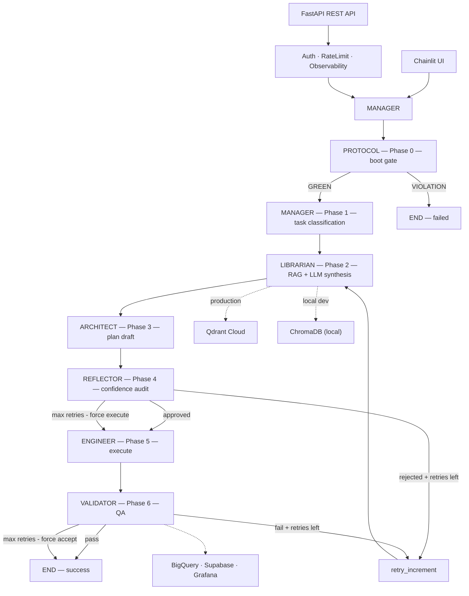
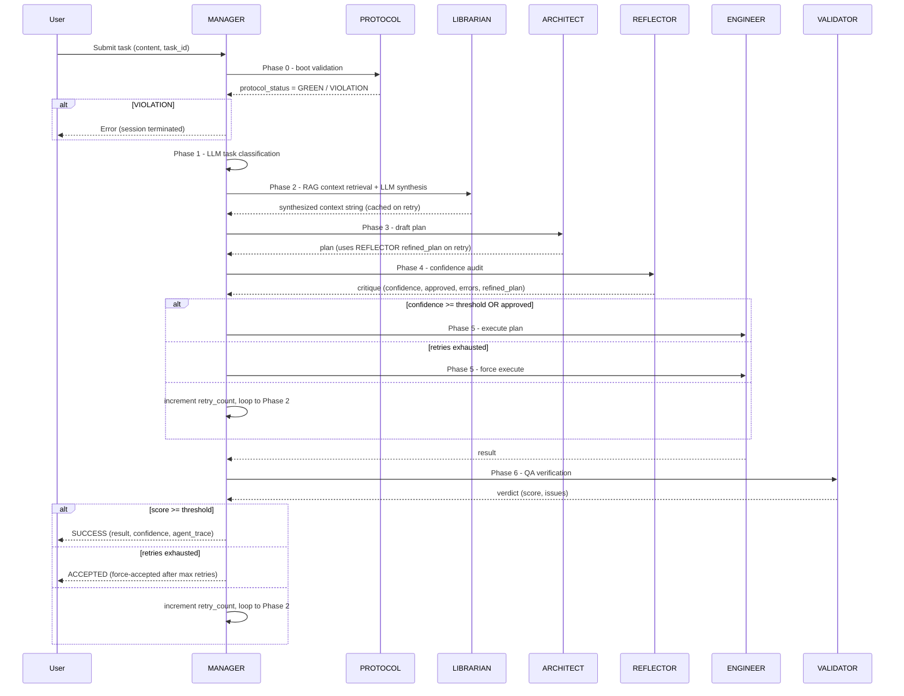
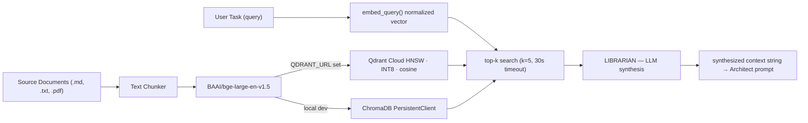
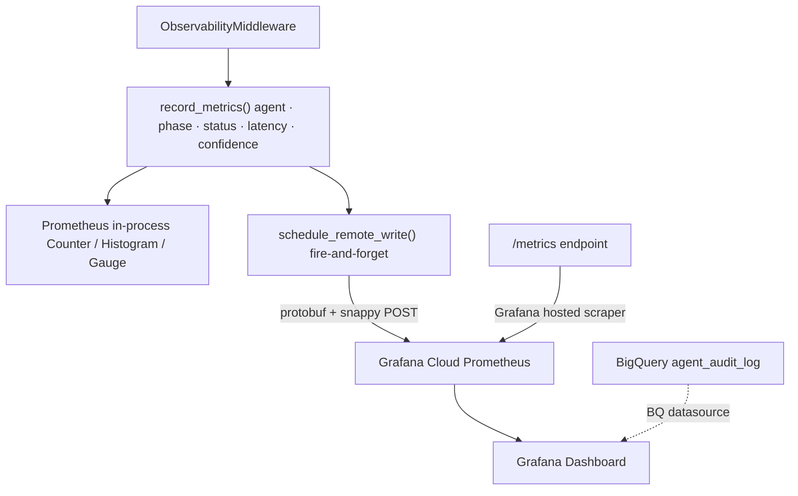
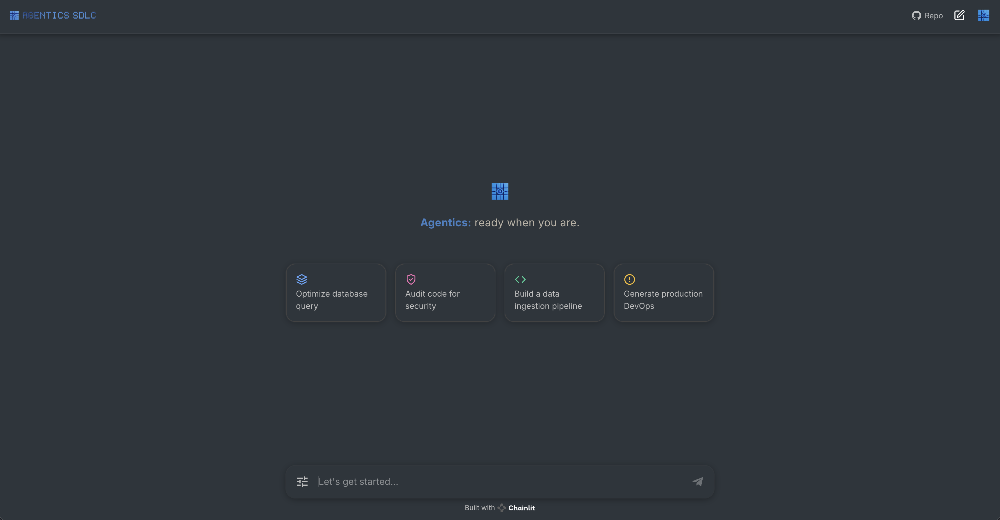
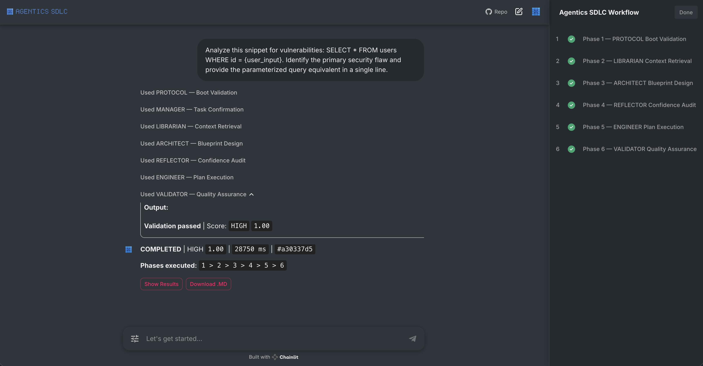
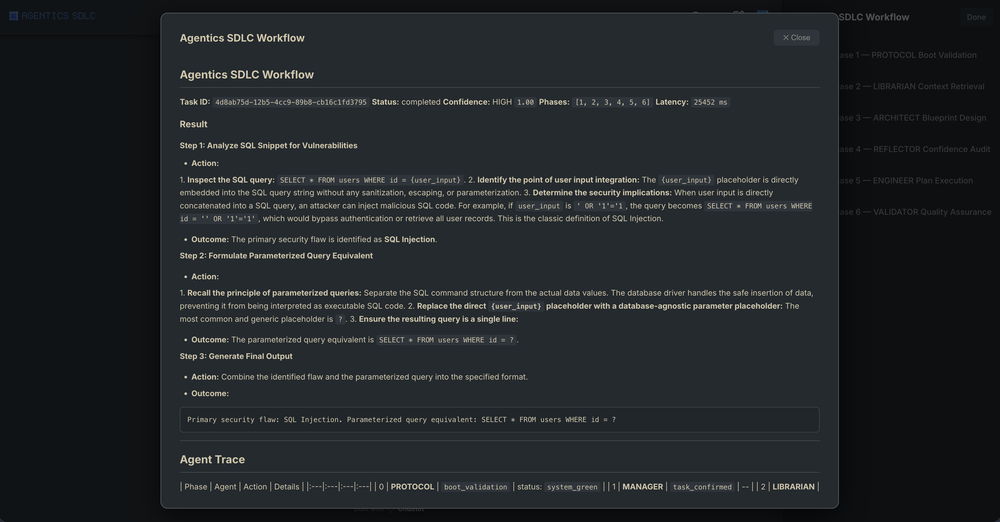
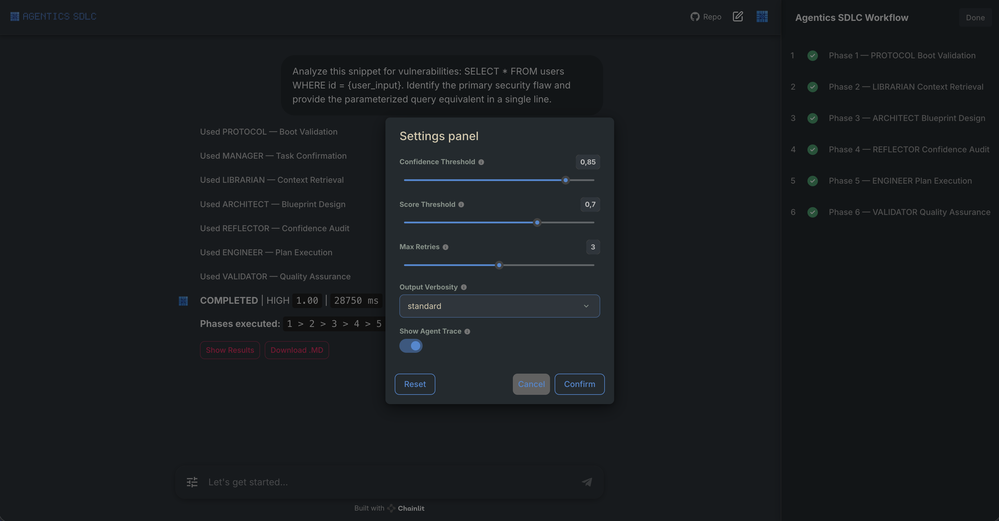
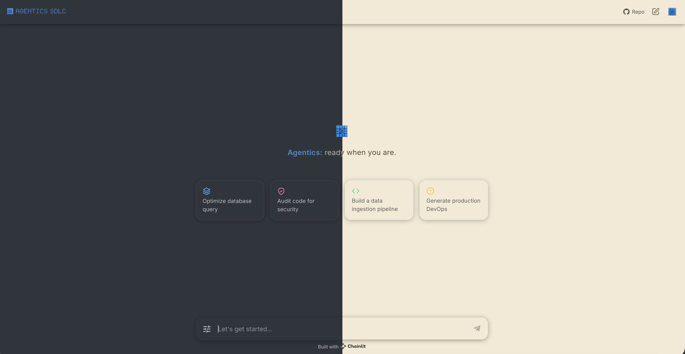
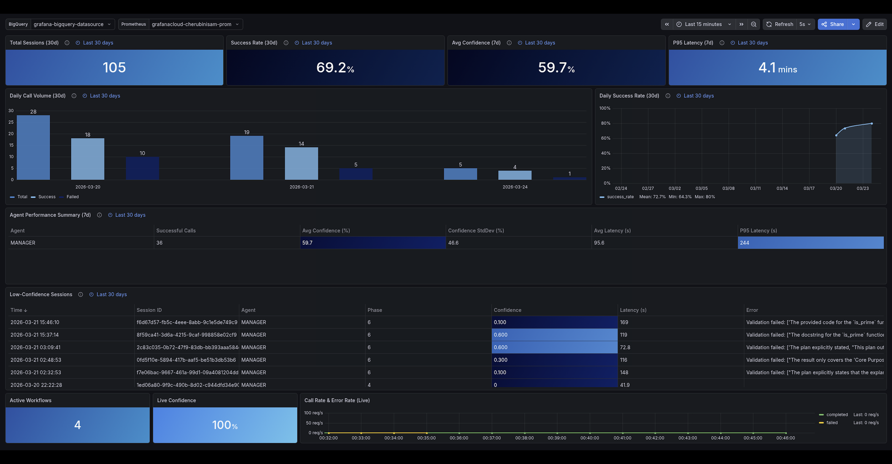

# Agentics SDLC

A production-grade, serverless Multi-Agent System that orchestrates the Software Development Life Cycle end-to-end through a protocol-enforced 6-phase pipeline.

<!-- AI / LLM / Orchestration -->


<!-- Backend / Data / Storage -->


<!-- Infrastructure / DevX -->


---

## Table of Contents

- [Agentics SDLC](#agentics-sdlc)
  - [Table of Contents](#table-of-contents)
  - [Video Demo](#video-demo)
  - [📖 Overview](#-overview)
    - [Highlights](#highlights)
  - [🏗️ Architecture Overview](#️-architecture-overview)
    - [6-Phase Workflow Sequence](#6-phase-workflow-sequence)
  - [🤖 Agent Roster](#-agent-roster)
  - [🚀 Quickstart](#-quickstart)
    - [Prerequisites](#prerequisites)
    - [Installation](#installation)
    - [Minimum `.env` Configuration](#minimum-env-configuration)
    - [Basic Usage](#basic-usage)
  - [🛠️ Technology Stack](#️-technology-stack)
  - [🔍 RAG Pipeline](#-rag-pipeline)
  - [🧠 Skills Library](#-skills-library)
  - [📊 Observability Architecture](#-observability-architecture)
  - [📁 Directory Structure](#-directory-structure)
  - [✨ Showcase](#-showcase)
    - [Screenshots](#screenshots)
  - [📚 Advanced Documentation](#-advanced-documentation)
  - [🤝 Contributing](#-contributing)
  - [📄 License](#-license)

---

## Video Demo

https://github.com/user-attachments/assets/1bd50625-f2af-49cb-94f2-2190cad87462

---

## 📖 Overview

**Agentics SDLC** is a production-grade, serverless **Multi-Agent System (MAS)** built on **LangGraph**, where each node is a specialist AI agent. You submit a high-level intent — "Build this feature" — and the system coordinates seven specialized agents through a strict 6-phase pipeline to produce production-quality output. Every phase is protocol-enforced: the PROTOCOL agent validates every session at boot, and the REFLECTOR applies a 4-persona confidence audit before any code is executed.

Two independent interfaces run on top of the same LangGraph graph: a **FastAPI** REST backend with SSE streaming, and a **Chainlit** real-time chat UI with live per-phase Steps. Observability is handled by Prometheus metrics pushed to Grafana Cloud, with BigQuery storing per-agent audit logs and Supabase persisting workflow snapshots. Everything is codified in **Terraform** and deployed to **GCP Cloud Run** via a CI/CD service account.

### Highlights

- **Protocol Boot Gate:** The PROTOCOL agent validates every incoming request at Phase 0 before any pipeline work begins. Violations terminate the session immediately — no task work is ever performed on a violating request.
- **Confidence-Gated Retry Loop:** The REFLECTOR runs a 4-persona critique (Judge, Critic, Refiner, Curator). On low confidence, the ARCHITECT receives the refined plan on retry rather than cold re-drafting. Force-execute after max retries guarantees a response.
- **Two-Tier Knowledge Base:** `.agent/static/` is loaded into each agent's system prompt at init (governance every agent applies on every call); `.agent/rag/` is indexed for LIBRARIAN top-k retrieval (skill knowledge that varies per task). Static loading is deterministic; RAG synthesis bridges cross-cutting context.
- **RAG Pipeline:** BGE-large embeddings with Qdrant Cloud (HNSW + INT8 scalar quantization) in production; ChromaDB locally. Context is cached in state so retry loops skip re-retrieval.
- **LoRA Fine-tuning:** Vertex AI SFT pipeline for the Protocol gatekeeper — synthetic data generation, LoRA training, and F1-gated evaluation in three phases.
- **End-to-End Observability:** Prometheus metrics pushed to Grafana Cloud after every task (solves the Cloud Run counter-reset problem). BigQuery stores per-agent audit logs; Supabase stores workflow snapshots.
- **Live Step Streaming:** Every agent phase streams LLM tokens in real time via Chainlit Steps with dedicated avatars and progress tracking.
- **Artifact Persistence:** Engineer and Validator outputs are persisted to GCS at `gs://<bucket>/artifacts/{task_id}/` after every workflow run.

---

## 🏗️ Architecture Overview



### 6-Phase Workflow Sequence



---

## 🤖 Agent Roster

| Agent         | Phase                    | Role                                                                                                         |
| :------------ | :----------------------- | :----------------------------------------------------------------------------------------------------------- |
| **MANAGER**   | Coordinator · Phase 1 — task classification | Central router and orchestrator (active). Builds the StateGraph, runs LLM task classification at Phase 1, and dispatches to all agents. |
| **PROTOCOL**  | Phase 0 — boot gate      | Boot integrity validator (active). Checks every request before Phase 1; violations terminate immediately.    |
| **LIBRARIAN** | Phase 2 — context        | Top-k RAG retrieval followed by LLM synthesis into a coherent context string. Caches result in state to skip re-retrieval on retry. |
| **ARCHITECT** | Phase 3 — plan           | Drafts execution plan from task + context. On retry, consumes REFLECTOR's refined plan.                      |
| **REFLECTOR** | Phase 4 — critique       | 4-persona confidence audit (Judge, Critic, Refiner, Curator). Emits score and refined plan; gates execution. |
| **ENGINEER**  | Phase 5 — execution      | Executes the approved plan. Receives force-execute after max retries.                                        |
| **VALIDATOR** | Phase 6 — QA             | Verifies output against task and plan. Produces normalized score; gates retry or acceptance.                 |

---

## 🚀 Quickstart

### Prerequisites

- Python 3.11+
- Poetry
- A GCP project with Vertex AI API enabled
- `gcloud` CLI authenticated (`gcloud auth application-default login`)

### Installation

```bash
git clone <repo-url>
cd agenticssdlc
poetry install
```

### Minimum `.env` Configuration

```dotenv
GCP_PROJECT_ID=your-gcp-project-id
GCP_REGION=us-central1
GEMINI_MODEL=gemini-2.5-flash

# Leave empty to disable auth (local dev)
AGENTICS_SDLC_API_KEY=

# Leave empty to use local ChromaDB
QDRANT_URL=
QDRANT_API_KEY=
```

### Basic Usage

```bash
# Start the FastAPI backend
poetry run uvicorn src.api.main:create_app --factory --host 0.0.0.0 --port 8080 --reload

# Ingest knowledge base
poetry run python scripts/scripts_rag.py

# Submit a task
curl -s -X POST http://localhost:8080/api/v1/task \
  -H "Content-Type: application/json" \
  -d '{"content": "Explain the REFLECTOR confidence audit"}'
```

```bash
# Start the Chainlit UI
export UI_AUTH_PASSWORD_HASH='$2b$12$...'  # generate with: python -c "import bcrypt; print(bcrypt.hashpw(b'yourpassword', bcrypt.gensalt()).decode())"
poetry run chainlit run src/ui/ui_chainlit_app.py --host 0.0.0.0 --port 8000
```

---

## 🛠️ Technology Stack

| Category                    | Technology                        | Purpose                                                                             |
| :-------------------------- | :-------------------------------- | :---------------------------------------------------------------------------------- |
| **Orchestration**           | LangGraph 0.2                     | Stateful graph engine for multi-phase agent coordination and retry logic.           |
| **LLM Framework**           | LangChain 0.3                     | Unified interface for LLM interaction and async Vertex AI integration.              |
| **LLM Backend**             | Google Gemini (Vertex AI)         | High-context, function-calling engine with native GCP security.                     |
| **LLM Fine-tuning**         | Vertex AI SFT + LoRA              | Parameter-efficient adapter training with synthetic data generation and evaluation. |
| **API Layer**               | FastAPI + Uvicorn                 | Async REST framework with OpenAPI generation and lifecycle management.              |
| **Chat UI**                 | Chainlit 1.3                      | Real-time streaming interface for per-phase agent tracking.                         |
| **Embeddings**              | Sentence Transformers / BGE-large | 1024-dim dense vector model for high-recall RAG retrieval.                          |
| **Vector Store (prod)**     | Qdrant Cloud                      | Quantized HNSW index for high-performance memory-efficient search.                  |
| **Vector Store (dev)**      | ChromaDB (persistent local)       | Persistence-backed local vector store for zero-config development.                  |
| **Embedding Runtime**       | PyTorch 2.3 (CPU-only in Docker)  | Optimized CPU-only runtime for lightweight container deployment.                    |
| **Settings**                | Pydantic v2 BaseSettings          | Fail-fast environment configuration with type-safe validated singletons.            |
| **Artifact Storage**        | Google Cloud Storage              | Per-task persistence of Engineer and Validator outputs as JSON blobs.               |
| **Analytics - Audit**       | Google BigQuery                   | Non-blocking async ingestion of per-agent audit logs.                               |
| **Analytics - State**       | Supabase (Postgres)               | Persistence for workflow snapshots and execution traces.                            |
| **Observability - Metrics** | Prometheus                        | Real-time telemetry for latency, confidence, and system health.                     |
| **Observability - Push**    | Grafana Cloud remote-write        | Custom remote-write implementation for ephemeral serverless metrics.                |
| **Infrastructure**          | Google Cloud Run v2               | Serverless container orchestration with auto-scaling and CPU boost.                 |
| **IaC**                     | Terraform 1.7+ (GCS backend)      | Declarative infrastructure management for all GCP and storage resources.            |
| **Containerisation**        | Docker (multi-stage, 3 stages)    | Multi-stage non-root images optimized for cold-start performance.                   |
| **Auth - API**              | Custom middleware (API key)       | Header-based API key validation for secure endpoint access.                         |
| **Auth - UI**               | BCrypt password hashing           | Hashed credential validation for secure session-based UI access.                    |
| **Rate Limiting**           | Custom middleware                 | Sliding window rate limiting to protect LLM quotas.                                 |
| **Data Validation**         | Pydantic v2 schemas               | Structured error handling and schema enforcement for all endpoints.                 |
| **Dependency Management**   | Poetry + pre-commit               | Reproducible environment management with pre-commit quality gates.                  |
| **Testing**                 | Pytest                            | Async test suite for unit and integration coverage.                                 |

---

## 🔍 RAG Pipeline



---

## 🧠 Skills Library

`.agent/rag/skills/` holds ten language-agnostic skill definitions covering the full SDLC. Each skill is a fully self-contained reference: a single retrieval gives the consuming agent everything it needs for that domain — scope description, directional patterns, required outputs, and common failure modes — without depending on any other skill or governance document. Each skill is grounded in an authoritative source (NIST SSDF, OWASP SAMM, Google SRE, DORA, C4, ADR, RFC 9457, Diátaxis). LIBRARIAN retrieves the most relevant skill at Phase 2 and synthesises it into the context string consumed by downstream agents.

| # | Skill | SDLC Stage | Primary Agents | Authoritative Source | Focus |
| :--- | :--- | :--- | :--- | :--- | :--- |
| 1 | **skills_architecture_design** | Design | ARCHITECT | C4 model + ADR (Nygard) | Decomposition, boundary hygiene, decision records, cross-cutting concerns |
| 2 | **skills_api_contract** | Design | ARCHITECT, ENGINEER | RFC 9457, RFC 7396 | Resource shape, idempotency, error semantics, versioning |
| 3 | **skills_data_modeling** | Design | ARCHITECT, ENGINEER | Database refactoring (Ambler) | Schema hygiene, normalisation, constraints, expand→contract migrations |
| 4 | **skills_code_execution** | Build | ENGINEER, REFLECTOR | NIST SSDF (PW.5, PW.7) | Forbidden patterns, hygiene markers, structural style, complexity |
| 5 | **skills_test_authoring** | Verify | ENGINEER, VALIDATOR | Cohn test pyramid | Pyramid balance, authoring discipline, coverage targets, determinism |
| 6 | **skills_security_review** | Verify | REFLECTOR, VALIDATOR | OWASP SAMM, NIST SSDF (PS, PW, RV) | Secrets, injection, authn/authz, supply chain |
| 7 | **skills_performance_profiling** | Verify | ENGINEER, VALIDATOR | Google SRE Ch. 6 | Baseline, hotspot analysis, targeted optimisation, regression guard |
| 8 | **skills_observability** | Operate | ENGINEER, VALIDATOR | Google SRE — four golden signals + SLI/SLO | Golden signals, SLI/SLO, telemetry hygiene, sensitive data |
| 9 | **skills_release_engineering** | Deliver | ENGINEER, VALIDATOR | DORA — *Accelerate*, *State of DevOps* | CI discipline, deployment strategy, rollback safety, DORA metrics |
| 10 | **skills_documentation** | Communicate | LIBRARIAN, all | Diátaxis four-mode framework | Tutorial / how-to / reference / explanation, doc-as-code, freshness |

Skill structure is uniform across all ten files: frontmatter, `## Scope` description, topic sections of directional guidance, common failure modes, and required outputs. The library divides the SDLC into ten non-overlapping columns, so retrieving one skill never leaves a gap that another skill silently fills, and adding an eleventh skill requires retiring an existing one — the library size is fixed at ten by design.

---

## 📊 Observability Architecture



> See [CHEATSHEET.md → Enabling the Grafana dashboard locally](CHEATSHEET.md#enabling-the-grafana-dashboard-locally) for the three env vars to uncomment in `.env` to light up the live panels.

---

## 📁 Directory Structure

```
agenticssdlc/
├── src/
│   ├── agents/                  # All 7 agent implementations
│   │   ├── agents_manager.py    # LangGraph StateGraph orchestrator + Phase 1 task classifier
│   │   ├── agents_base.py       # Abstract base with exponential backoff LLM calls
│   │   ├── agents_architect.py  # Plan drafting agent
│   │   ├── agents_engineer.py   # Code/task execution agent
│   │   ├── agents_validator.py  # QA verification agent
│   │   ├── agents_reflector.py  # 4-persona confidence audit agent
│   │   ├── agents_librarian.py  # RAG context retrieval agent
│   │   ├── agents_protocol.py   # Boot validation middleware agent
│   │   └── agents_utils.py      # All string constants (zero magic strings)
│   ├── api/
│   │   ├── main.py              # FastAPI application factory + lifespan
│   │   ├── routers/             # Health, Tasks, Agents endpoints
│   │   ├── middleware/          # Auth, RateLimit, Observability
│   │   └── schemas/             # Pydantic v2 request/response models
│   ├── core/
│   │   ├── core_config.py                 # Pydantic Settings singleton (lru_cache)
│   │   ├── core_llm.py                    # Gemini/Vertex AI LLM singleton
│   │   ├── core_logging.py                # Structured logging setup
│   │   ├── core_remote_write.py           # Custom protobuf + Snappy Prometheus push
│   │   ├── core_heartbeat.py              # Background heartbeat writer keeping live panels populated
│   │   └── core_utils.py                  # Shared core constants and helpers
│   ├── rag/
│   │   ├── rag_vector_store.py  # Qdrant/ChromaDB factory abstraction
│   │   ├── rag_embeddings.py    # BGE-large wrapper (lru_cache)
│   │   ├── rag_retriever.py     # Top-k async retrieval with 30s timeout
│   │   └── rag_ingestion.py     # Document ingestion pipeline
│   ├── tuning/
│   │   ├── tuning_config.py     # Pydantic schemas + TuningSettings singleton
│   │   ├── tuning_utils.py      # Constants (zero-magic-strings policy)
│   │   ├── tuning_generator.py  # Synthetic data generation (compliant/adversarial/edge-case)
│   │   ├── tuning_train.py      # Vertex AI SFT orchestration + LoRA deployment
│   │   ├── tuning_evaluate.py   # Model evaluation (precision/recall/F1)
│   │   └── notebook/            # Interactive exploration notebooks
│   ├── analytics/
│   │   ├── analytics_bigquery_ingest.py   # Non-blocking BQ audit logger
│   │   ├── analytics_supabase_ingest.py   # Workflow snapshot upserts
│   │   └── analytics_scheduled_queries.sql
│   ├── storage/
│   │   ├── storage_gcs.py                 # Per-task GCS artifact persistence (Engineer + Validator)
│   │   └── storage_utils.py               # Bucket / path constants and helpers
│   └── ui/
│       ├── ui_chainlit_app.py   # Chainlit session/message/streaming handlers
│       ├── ui_chainlit_formatters.py
│       └── ui_chainlit_utils.py
├── platform/
│   ├── terraform/               # Full GCP infra as code (Cloud Run, BQ, GCS, Secrets, IAM)
│   ├── docker/                  # Multi-stage Dockerfiles (API + UI)
│   └── sql/                     # Supabase schema init
├── tests/
│   ├── unit/                    # Agent and schema unit tests
│   └── integration/             # API endpoint integration tests
├── .agent/                      # Agent knowledge base (two roots: static + rag)
│   ├── static/                  # Loaded into agent system prompts at init (12 docs)
│   │   ├── protocols/           #   core_laws, quality_standards, workflow
│   │   ├── roles/               #   architect, engineer, librarian, manager, protocol, reflector, validator
│   │   └── rules/               #   stack, style
│   └── rag/                     # Indexed for LIBRARIAN top-k retrieval (10 skills)
│       └── skills/              #   architecture_design, api_contract, data_modeling,
│                                #   code_execution, test_authoring, security_review,
│                                #   performance_profiling, observability,
│                                #   release_engineering, documentation
├── pyproject.toml               # Poetry and tool configuration
└── .pre-commit-config.yaml      # Git hooks
```

---

## ✨ Showcase

### Screenshots

<table>
  <tr>
    <td align="center" width="50%">
      <strong>App UI: Welcome Screen</strong><br/>
      <em>Clean entry point with curated starter tasks</em><br/><br/>
      
    </td>
    <td align="center" width="50%">
      <strong>App UI: Live Chat</strong><br/>
      <em>Real-time agent Steps, TaskList progress tracker, confidence badge, and agent trace panel</em><br/><br/>
      
    </td>
  </tr>
  <tr>
    <td align="center" width="50%">
      <strong>Workflow Result: Full Output</strong><br/>
      <em>Task ID, status, confidence score, phases executed, implementation, and agent trace</em><br/><br/>
      
    </td>
    <td align="center" width="50%">
      <strong>Settings Panel</strong><br/>
      <em>Confidence threshold, score threshold, max retries, verbosity, and agent trace toggle</em><br/><br/>
      
    </td>
  </tr>
  <tr>
    <td align="center" width="50%">
      <strong>Dark / Light Mode</strong><br/>
      <em>Split view: dark mode on the left, light mode on the right</em><br/><br/>
      
    </td>
    <td align="center" width="50%">
      <strong>Grafana Observability Dashboard</strong><br/>
      <em>Prometheus metrics: agent calls, latency histograms, confidence gauges</em><br/><br/>
      
    </td>
  </tr>
</table>

---

## 📚 Advanced Documentation

For deployment commands, infrastructure reference, and the LoRA fine-tuning pipeline, see [CHEATSHEET.md](CHEATSHEET.md).

```bash
poetry run pytest --cov=src --cov-report=term-missing
poetry run pytest tests/unit/
poetry run pytest tests/integration/
```

---

## 🤝 Contributing

Contributions are welcome. Please ensure all tests pass and pre-commit hooks are clean before submitting a pull request. The CI pipeline runs Black, isort, Flake8, and pytest with 70% coverage enforcement.

---

## 📄 License

See [LICENSE](LICENSE) for details.

**Maintainer:** Samuele Cherubini — cherubini.sam@gmail.com
